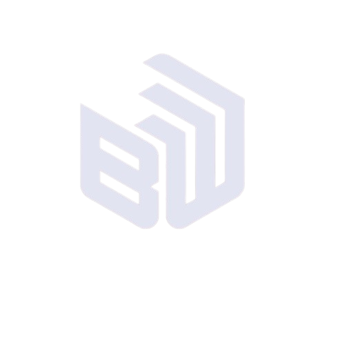

<!-- =========================================================
     PERFIL GITHUB — Patricia Correia
     README bilingue: English (EN) / Português (PT-BR)
     Tema: Dark / Moderno
     ========================================================= -->

<!-- ===================== LOGO DA EMPRESA =====================
     Substitua o caminho abaixo pela imagem da logo da BW Station.
     Coloque o arquivo (ex.: bwstation-logo.png) na raiz/assets do repo. -->

  

 

<!-- ===================== HEADER / BANNER ===================== -->

  

  

    
    
    
  

  <!-- ===================== SELETOR DE IDIOMA ===================== -->
  

    <a href="#-english">🇺🇸 English</a>
    &nbsp;•&nbsp;
    <a href="#-português">🇧🇷 Português</a>
  

---

<!-- ============================================================= -->
<!-- =====================  ENGLISH VERSION  ===================== -->
<!-- ============================================================= -->

## 🇺🇸 English

### 👩‍💻 About me

I'm a **Financial Analyst** at **BW Station (Mercado BIM)**, working at the intersection of finance and technology. Day to day, I turn manual processes into reliable **automations** and contribute to **QA testing** in software development, ensuring quality and consistency across deliverables.

- Data- and process-oriented financial analysis
- Building **automations** to eliminate repetitive tasks
- **QA testing** (manual and automated) on software projects
- Focus on efficiency, quality, and continuous improvement

### 🛠️ Technologies & Tools

**Automation & Development**

  
  
  
  
  

**QA & Testing**

  
  

**Financial Analysis & Data**

  
  
  

<a href="#-português">⬇ Português</a>

---

<!-- ============================================================= -->
<!-- =====================  VERSÃO EM PORTUGUÊS  ================= -->
<!-- ============================================================= -->

## 🇧🇷 Português

### 👩‍💻 Sobre mim

Sou **Analista Financeira** na **BW Station (Mercado BIM)**, com atuação que cruza finanças e tecnologia. No dia a dia, transformo processos manuais em **automações** confiáveis e contribuo com **testes de QA** no desenvolvimento de software, garantindo qualidade e consistência das entregas.

- Análise financeira orientada a dados e processos
- Desenvolvimento de **automações** para eliminar tarefas repetitivas
- **Testes de QA** (manuais e automatizados) em projetos de software
- Foco em eficiência, qualidade e melhoria contínua

### 🛠️ Tecnologias & Ferramentas

**Automação & Desenvolvimento**

  
  
  
  
  

**QA & Testes**

  
  

**Análise Financeira & Dados**

  
  
  

<a href="#-english">⬆ English</a>

<!-- ===================== GITHUB STATS (opcional) =====================
---

### 📊 GitHub Stats

  
  
   
  

===================================================================== -->

---

  💼 Made with dedication at <strong>BW Station</strong> · Feito com dedicação na <strong>BW Station</strong>

